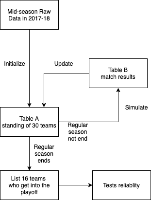

```{r setup, include=FALSE}
knitr::opts_chunk$set(echo = TRUE)
```

\pagebreak

# Abstract 

The main purpose of our project is simulating match results and predicting NBA playoff teams for season 2017-18 based on this season's real data, and comparing our results with this season's real data to calculate our method's accuracy, since analyzing and predictiong NBA stats is popular currently. The method we used in our project includes **Random number generations**, **Permutation test** and **Ridge regression**. 

We found that regarding the playoff teams for season 2017-18, the accuracy of our prediction is $87.5 \% \ (14/16)$ when comapring the actual result. The result can be regarded as accurate beacuse we used each team's former performance in this season to make predictions, which is reliable. But there are still some conditions that were not included in the model, like player's injury, team's stamina and so on.

# Introduction

```{r, fig.align="center",echo=FALSE,out.height='280px'}

```


The National Basketball Association (NBA) is one of the most worldwide popular sporting events that is held every year in the world. 

* It has two conferences, East and West, with 15 teams in each division. 
* 30 teams fight in the league fight for a champion in a year-long season from October to June every year. 
* Each season is split into regular season and playoffs. 
* Each team has 82 matches to play in their regular season 
* Teams in the same conference would play more often than those.
* Only the top 8 teams in each division are able to enter the playoffs of the season. 
* Ranks are determined ascending by a special statistic called Games Behind:
  + When team a is the leading team of the conference.
\[Team B’s games behind=\frac {(Team A’s Wins-Team A’s Losses)-(Team B’s Wins-Team B’s Losses)}{2}\]


Thus which 16 teams would enter the playoffs every season is one of the biggest mystery in NBA every season.

Our goal, as introduced above, is simulating match results and predicting NBA playoff teams. In other words, we are going to predict which eight teams in each conference would get the lowest games behind by the end of the regular season. 

The focus is on the past 17-18 season. We will try to predict based on prior part of this season’s real data, and comparing our results with this season’s real data in the rest season to calculate our method’s accuracy. If we found our prediction is reliable in this season, we have prepared data in the past 10 years for test and verification.


# Methods

## Processing Data

### Raw Data

Raw datasets we used in our project are "2017-18_standing.csv" and "2017-18_teamBoxScore.csv", whose details are showed below:
```{r,echo=FALSE}
standing_data=read.csv("2017-18_standings.csv")
match_data=read.csv("2017-18_teamBoxScore.csv")
```
From 2017-18_standing.csv
```{r}
str(standing_data[,c(1,2,13,14,15,16,17,18,20,21)])
```
From 2017-18_teamBoxScore.csv
```{r}
str(match_data[,c(1,10,11,13,14,17,73)])
```

### Processing data to fit models

```{r, echo = FALSE, cache = TRUE}
data_standings = read.csv("2017-18_standings.csv")
data_boxscore = read.csv("2017-18_teamBoxScore.csv")
data_boxscore_total = read.csv("nba-enhanced-stats/2012-18_teamBoxScore.csv")
team_level = data_standings$teamAbbr[1:30]

data_hist = matrix(NA, 900, 5)
data_hist = as.data.frame(data_hist)
colnames(data_hist) = c("team1", "team2", "hist_win", "hist_lost", "hist_rate")

for (i in 1:30) {
  for (j in 1:30) {
    if (i != j) {
      data_hist[(i-1)*30 + j, 1] = as.character(team_level[i])
      data_hist[(i-1)*30 + j, 2] = as.character(team_level[j])
      totalResult1 = data_boxscore_total$teamRslt[which((data_boxscore_total$teamAbbr == team_level[i]) & (data_boxscore_total$opptAbbr == team_level[j]))]
      totalResult2 = data_boxscore_total$teamRslt[which((data_boxscore_total$teamAbbr == team_level[j]) & (data_boxscore_total$opptAbbr == team_level[i]))]
      totalGame = length(totalResult1) + length(totalResult2)
      totalWin = sum(as.numeric(totalResult1) - 1) + (length(totalResult2) - sum(as.numeric(totalResult2) - 1))
      totalLose = sum(as.numeric(totalResult2) - 1) + (length(totalResult1) - sum(as.numeric(totalResult1) - 1))
      data_hist[(i-1)*30 + j, 3] = totalWin
      data_hist[(i-1)*30 + j, 4] = totalLose
      data_hist[(i-1)*30 + j, 5] = totalWin / totalGame
    }
  }
}

data_hist = data_hist[!is.na(data_hist$team1),]

startMatchfit = min(which(data_boxscore$gmDate == "2017-12-01"))
endMatchfit = max(which(data_boxscore$gmDate == "2018-03-11"))

data_fit = as.data.frame(matrix(NA, endMatchfit - startMatchfit + 1, 9))
data_fit[,1] = data_boxscore$gmDate[startMatchfit:endMatchfit]
data_fit[,2] = data_boxscore$teamAbbr[startMatchfit:endMatchfit]
data_fit[,3] = data_boxscore$opptAbbr[startMatchfit:endMatchfit]
for (i in 1:nrow(data_fit)) {
  data_fit[i,4] = data_standings$homeWin[which(data_standings$stDate == data_fit[i,1] & data_standings$teamAbbr == data_fit[i, 2])] / 
    (data_standings$homeLoss[which(data_standings$stDate == data_fit[i,1] & data_standings$teamAbbr == data_fit[i, 2])] +
       data_standings$homeWin[which(data_standings$stDate == data_fit[i,1] & data_standings$teamAbbr == data_fit[i, 2])])
  data_fit[i,5] = data_standings$homeWin[which(data_standings$stDate == data_fit[i,1] & data_standings$teamAbbr == data_fit[i, 3])] / 
    (data_standings$homeLoss[which(data_standings$stDate == data_fit[i,1] & data_standings$teamAbbr == data_fit[i, 3])] +
       data_standings$homeWin[which(data_standings$stDate == data_fit[i,1] & data_standings$teamAbbr == data_fit[i, 3])])
  data_fit[i,6] = data_standings$lastTen[which(data_standings$stDate == data_fit[i,1] & data_standings$teamAbbr == data_fit[i, 2])] / 10
  data_fit[i,7] = data_standings$lastTen[which(data_standings$stDate == data_fit[i,1] & data_standings$teamAbbr == data_fit[i, 3])] / 10
  data_fit[i,8] = data_hist$hist_rate[which(data_hist$team1 == as.character(data_fit[i,2]) & data_hist$team2 == as.character(data_fit[i, 3]))]
}
colnames(data_fit) = c("gmDate", "homeTeam", "awayTeam", "homeTeamRate", "awayTeamRate", "homeTeamlast10", "awayTeamlast10", "histRate", "Result")
data_fit[,9] = data_boxscore$teamRslt[startMatchfit:endMatchfit]
#data_fit[,4] = as.numeric(data_fit[,4]) - 1
glm1 = glm(Result ~ homeTeamRate + awayTeamRate + homeTeamlast10 + awayTeamlast10 + histRate, family = binomial, data = data_fit)
```

In our project, we used actual match result from *2017-12-01* to *2018-03-11* to fit a model, and used this model to predict match result from *2018-03-12* to the end of NBA 2017-18 regular season. 

### Processing table_a and table_b

Since for simulation part, we have to update the teams' standing after each simulation and use updated data to simulate next match result. We decided to made two tables A and B to store the standing data of all teams (in A) and the match data of each matches (in B). Then use the "current" standing data in A to simulate upcoming matches in B and use the following match data to regenerate new standing data in A.

The following chart about how we use table_a and table_b is showed below (detailed information will be shown in *Simulation* part):

```{r, fig.align="center",echo=FALSE}

```

```{r,echo=FALSE}
creattablea = function(standing,match,today){
  standing=standing_data[standing_data$stDate==today,]
  match=match[as.Date(as.character(match$gmDate), format="%Y-%m-%d")-
                  as.Date(as.character(today), format="%Y-%m-%d")<=0,]
  teamname=standing$teamAbbr
  confname=rep("",30)
  for(i in 1:30){
    confname[i]=as.character(match[head(which(match$teamAbbr==teamname[i]),n=1),]$teamConf)
  }
  homerate=standing$homeWin/(standing$homeLoss+standing$homeWin)
  homematch=(standing$homeLoss+standing$homeWin)
  awayrate=standing$awayWin/(standing$awayLoss+standing$awayWin)
  awaymatch=(standing$awayLoss+standing$awayWin)
  last10=standing$lastTen/10
  homescorewin=numeric(30)
  awayscorewin=numeric(30)
  homescorelost=numeric(30)
  awayscorelost=numeric(30)
  for(i in 1:30){
    tempmatch=match[match$teamAbbr==teamname[i],]
    homescorewin[i]=mean(tempmatch[tempmatch$teamLoc=="Home",]$teamPTS)
    awayscorewin[i]=mean(tempmatch[tempmatch$teamLoc=="Away",]$teamPTS)
    homescorelost[i]=mean(tempmatch[tempmatch$teamLoc=="Home",]$opptPTS)
    awayscorelost[i]=mean(tempmatch[tempmatch$teamLoc=="Away",]$opptPTS)
  }
  lastgame = match$teamLoc[1:30]#home or away
  numberdayoff=numeric(30)
  for(j in 1:10){
      assign(paste0("l", j), numeric(30))
    }
  for(i in 1:30){
    tempmatch=match[match$teamAbbr==teamname[i],]
    tempid=max(which(as.Date(as.character(tempmatch$gmDate), format="%Y-%m-%d")-
                  as.Date(as.character(today), format="%Y-%m-%d")<0))
    lastgame[i] = tempmatch[tempid,]$teamLoc
    
    lastgamedate = tempmatch[tempid,]$gmDate
    numberdayoff[i] = abs(as.Date(as.character(lastgamedate), format="%Y-%m-%d")-
                  as.Date(as.character(today), format="%Y-%m-%d"))
    
    last10match=rev(tail(tempmatch$teamRslt, 10))
    l1[i]=last10match[1]
    l2[i]=last10match[2]
    l3[i]=last10match[3]
    l4[i]=last10match[4]
    l5[i]=last10match[5]
    l6[i]=last10match[6]
    l7[i]=last10match[7]
    l8[i]=last10match[8]
    l9[i]=last10match[9]
    l10[i]=last10match[10]
    
  } 
  lastgame=as.character( lastgame)
  totalmatch=standing$gamePlay
  confmatch=standing$confWin+standing$confLoss
  confrate=standing$confWin/confmatch
  teamname=as.character(teamname)
  toreturn=data.frame(teamname,confname,homerate,awayrate,last10,homescorewin,homescorelost,awayscorewin,awayscorelost,confrate,numberdayoff,lastgame,totalmatch,confmatch,homematch, awaymatch, l1,l2,l3,l4,l5,l6,l7,l8,l9,l10)# homematch awaymatch last10result
  toreturn
}

tablea180311=creattablea(standing_data,match_data,"2018-03-11")

```
Basic information about table_a and table_b are as follows:

**Initial table_a:**
```{r}
str(tablea180311)
```
Columns’ meaning:

* "Teamname": Name of team
* "Confname": East or West, which defines which conference the team belongs to.
* "Homerate": winrate at home
* "Awayrate": winrate away
* "Last10": winrate in the last 10 matches
* "Homescorewin": score won when at home
* "Homescorelost": score lost when at home
* "Awayscorewin": score win when playing away home
* "Awayscorelost": score lost when to play away home
* "Confrate": winrate when playing within the conference
* "Numberdayoff": number of days since the last match
* "Lastgame": is the last game played at home or away
* "totalmatch":number of matches played
* "confmatch":number of matches played within conference
* "Homematch": number of matches played at home
* "Awaymatch": number of matches played away
* "l1" ~ "l10": is the last 1~10 win or lose

**Initial table_b:**
```{r, echo = FALSE, cache = TRUE}
data_boxscore = data_boxscore[data_boxscore$teamLoc == "Home",]
endMatch = max(which(data_boxscore$gmDate == "2018-04-11"))
startMatch = min(which(data_boxscore$gmDate == "2018-03-12"))
data_B = as.data.frame(matrix(NA, (endMatch - startMatch + 1), 56))
colnames(data_B) = c("gmDate", "HomeTeam(A)", "AwayTeam(B)", "SameConf", "HistData", 
                    "confname_A", "homerate_A", "awayrate_A", "last10_A", "homescorewin_A", "homescorelost_A", "awayscorewin_A", "awayscorelost_A",  "confrate_A", "numberdayoff_A", "lastgame_A", "totalmatch_A", "confmatch_A",
                    "homematch_A", "awaymatch_A", "l1_A", "l2_A", "l3_A", "l4_A", "l5_A", "l6_A", "l7_A", "l8_A", "l9_A", "l10_A", 
                    "confname_B", "homerate_B", "awayrate_B", "last10_B", "homescorewin_B", "homescorelost_B", "awayscorewin_B", "awayscorelost_B",  "confrate_B", "numberdayoff_B", "lastgame_B", "totalmatch_B", "confmatch_B", 
                    "homematch_B", "awaymatch_B", "l1_B", "l2_B", "l3_B", "l4_B", "l5_B", "l6_B", "l7_B", "l8_B", "l9_B", "l10_B","result")
data_B[, 1] = data_boxscore$gmDate[startMatch:endMatch]
data_B[, 2] = data_boxscore$teamAbbr[startMatch:endMatch]
data_B[, 3] = data_boxscore$opptAbbr[startMatch:endMatch]
data_B[, 4] = (data_boxscore$teamConf == data_boxscore$opptConf)[startMatch:endMatch]
for (i in 1:nrow(data_B)) {
  data_B[i, 5] = data_hist$hist_rate[which(data_hist$team1 == as.character(data_B[i,2]) & data_hist$team2 == as.character(data_B[i,3]))]
}
```

```{r}
str(data_B[,c(1,2,3,4,5,56)])
```
Columns’ meaning:

* "gmDate": Game date
* "Hometeam(A)": The Abbreviation of team A (played as home team)
* "Awayteam(B)": The Abbreviation of team B (played as away team)
* "SameConf": True if two teams are in the same conference, false if not
* "HistData": The historical rate for team A played with team B
* "result": The match result based on our simulation
* The rest of columns are the data that is contained in table_a describing conditions for both team A and team B 

## Generalized Linear Regression

Since each 

## Permutation Test

The generalized linear model we used to predict the game result includes predictors that might be correlated to each other. For example, `homeTeamRate` and `homeTeamlast10` seem to be positively correlated in common sense. Therefore, to improve our regression fit, we want to thorougly examine the correlations among the variables and proceed to use ridge regression if the variables are confirmed to be correlated. The variables for testing are,

* homeTeamRate
* awayTeamRate
* homeTeamlast10
* awayTeamlast10
* histRate

A permutation test essentially checks if X and Y have the same distribution by doing the following procedure,

1. Observe a test statistic for the null hypothesis, $H_0$
2. For each replicated $b = 1, 2,..., B$:
    - Generate a random permutation $\pi$
    - Generate a new test statistic from the random permutation
3. Get a Monte Carlo estimate of the p-value by calculating the probability of obtaining a new test statistic that is more extreme than the observed test statistic in the $B$ replicates
4. Reject $H_0$ at a significance level $\alpha$ if the p-value is less than $\alpha$.

In our case, we can inherit the idea of permutation test and adapt it to paired data to check the correlation in between. If there is truly no association between X and Y, the distribution of $(X_i, Y_{\pi(i)})$ will be the same as that of $(X_i, Y_i)$, where $\pi(i)$ is the $i$-th element of a permutation $\pi$ of ${1, 2, ..., 13}$. We implement this idea by randomly permuting Y and pairing it with a fixed X and get a p-value for testing $H_0: \rho = 0$ versus $H_1: \rho \neq 0$, where $\rho$ is either the Pearson correlation coefficient or the Spearman correlation coefficient:

- The *Pearson Method* evaluates the **linear** relationship between two continuous variables, where a change in one variable is associated with a **proportional** change in the other variable. 

- The *Spearman Method* is based on the ranked values for each variable rather than the raw data. It evaluates the **monotonic** relationship between two continuous or ordinal variables, where the variables tend to change together, but not necessarily at a constant rate. It is more general than the Pearson method. 

To determine which correlation coefficient to use for which pair of comparison, we plot variables against each another and added some noise using `jitter()` to visualize the trend of relationship and decide which method to use.

According to the plots, *Home Rate vs. Home Last 10*, *Away Rate vs. Away Last 10*, *Home Last 10 vs. Historical Rate*, and *Away Last 10 vs. Historical Rate* appear to be linear. We use the Pearson method for these pairs. For the rest pairs, trends are not that obvious. Therefore, we use the more genearl Spearman method.

## Ridge Regression 


# Results

## Linear Regrssion

## Permutation Test

By performing permutation tests, we obtained the following table, which shows all the pairs we tested, the method we used, the p-value for the permutation test, and the decisions based on the p-values. 

| Pairs                            | Method   | p-value    | Decision       |
|----------------------------------|----------|------------|----------------|
| Home Rate vs. Home Last 10       | Pearson  | 9.999e-05  | Correlated     |
| Away Rate vs. Away Last 10       | Pearson  | 9.999e-05  | Correlated     |
| Home Rate vs. Historical Rate    | Spearman | 9.999e-05  | Correlated     |
| Away Rate vs. Historical Rate    | Spearman | 9.999e-05  | Correlated     |
| Home Last 10 vs. Historical Rate | Pearson  | 9.999e-05  | Correlated     |
| Away Last 10 vs. Historical Rate | Pearson  | 9.999e-05  | Correlated     |
| Home Rate vs. Away Rate          | Spearman | 0.4131587  | Not Correlated |
| Home Last 10 vs. Away Last 10    | Spearman | 9.999e-05  | Correlated     |
| Home Rate vs. Away Last 10       | Spearman | 0.02689731 | Correlated     |
| Away Rate vs. Home Last 10       | Spearman | 0.02329767 | Correlated     |

We found that all pairs of variables have correlation except *Home Rate vs. Away Rate*. This observation suggests that there exists problem of collinearity among the predictors. It leads us to further examine the VIF (Variance Inflation Factor) of the predictors and fit a Ridge Regression model to remedy the problem of collinearity. 

## Ridge Regression 

## Simulation

```{r, echo = TRUE, cache = FALSE}
```


# Discussion
The test for correlation is not very accurate because the "Last 10" data (i.e. `homeTeamlast10` and `awayTeamlast10`) are highly categorical (discrete) because based on their calculation criteria: the number of times the team wins, which is an integer, divided by 10. When the "Last 10" data is paired with the other continuous variables, such as `homeTeamRate` and `histRate`, the correlation between a continuous variable and a somewhat discrete variable cannot be simply determined by correlation coefficients.


<!-- Force a new page for appendix -->
\newpage

# Appendix

### Scatterplots for Correlation

```{r, echo = FALSE}
data = read.csv("data_fit.csv")

par(mfrow = c(2,2))
plot(data$homeTeamRate, jitter(data$homeTeamlast10, 3), main = "Home Rate vs. Home Last 10")
plot(data$awayTeamRate, jitter(data$awayTeamlast10, 3), main = "Away Rate vs. Away Last 10")
plot(data$homeTeamRate, data$histRate, main = "Home Rate vs. Historical Rate")
plot(data$awayTeamRate, data$histRate, main = "Away Rate vs. Historical Rate")
par(mfrow = c(2,2))
plot(jitter(data$homeTeamlast10, 3), data$histRate, main = "Home Last 10 vs. Historical Rate")
plot(jitter(data$awayTeamlast10, 3), data$histRate, main = "Away Last 10 vs. Historical Rate")
plot(data$homeTeamRate, data$awayTeamRate, main = "Home Rate vs. Away Rate")
plot(jitter(data$homeTeamlast10, 3), jitter(data$awayTeamlast10, 3), main = "Home Last 10 vs. Away Last 10")
par(mfrow = c(2,2))
plot(data$homeTeamRate, jitter(data$awayTeamlast10, 3), main = "Home Rate vs. Away Last 10")
plot(data$awayTeamRate, jitter(data$homeTeamlast10, 3), main = "Away Rate vs. Home Last 10")
```

### Permutation Test with either correlation coefficient
```{r, eval = FALSE, echo = TRUE}
perm_test = function(X, Y, B = 10000, method = "pearson") {
  nu = seq_along(X)
  reps = numeric(B)
  
  if (method == "pearson") { # Pearson Method - default
    rho0 = abs(cor(X, Y))
    for ( i in 1:B ) {
      perm = sample(nu, size = length(X), replace = FALSE)
      X1 = X[perm]
      reps[i] = abs(cor(X1, Y))
    }
    pval = mean(c(rho0, reps) >= rho0)
  } else if (method == "spearman") { # Spearman Method
    rho0 = cor(X, Y, method = "spearman")
    t0 = abs(rho0*sqrt((length(X) - 2)/(1 - rho0^2)))
    for ( i in 1:B ) {
      perm = sample(nu, size = length(X), replace = FALSE)
      X1 = X[perm]
      rho = cor(X1, Y, method = "spearman")
      reps[i] = abs(rho*sqrt((length(X) - 2)/(1 - rho^2)))
    }
    pval = mean(c(t0, reps) >= t0)
  }
  
  return(pval)
}

# running the tests
perm_test(data$homeTeamRate, data$homeTeamlast10, 10000, "pearson")
perm_test(data$awayTeamRate, data$awayTeamlast10, 10000, "pearson")
perm_test(data$homeTeamRate, data$histRate, 10000, "spearman")
perm_test(data$awayTeamRate, data$histRate, 10000, "spearman")
perm_test(data$homeTeamlast10, data$histRate, 10000, "spearman")
perm_test(data$awayTeamlast10, data$histRate, 10000, "spearman")
perm_test(data$homeTeamRate, data$awayTeamRate, 10000, "spearman")
perm_test(data$homeTeamlast10, data$awayTeamlast10, 10000, "spearman")
perm_test(data$homeTeamRate, data$awayTeamlast10, 10000, "spearman")
perm_test(data$awayTeamRate, data$homeTeamlast10, 10000, "spearman")
```
